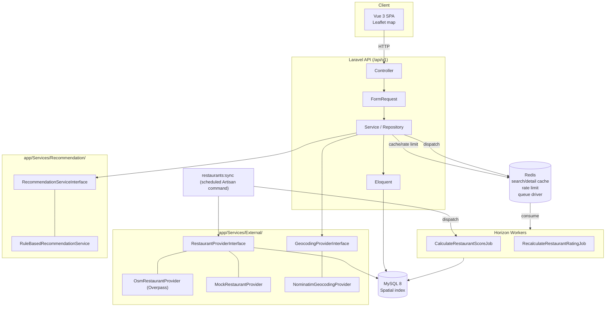

# VeggieMap

> A scalable vegetarian-friendly restaurant discovery platform built with Laravel, MySQL, Redis and modern geospatial search.

素食 × 地圖 × 多條件搜尋 × 寵物友善 × 使用者回報 × 素食可信度的餐廳探索平台。這是一個以「展示中高階
Backend Engineer 系統設計能力」為目標的作品專案，不是一個簡單 CRUD demo。

現況：後端 API 與 Vue 前端已完成並實測（526 個後端測試、283 個前端測試全綠）。
2026-08-26 補上一批**搜尋強化**：營業中篩選、關鍵字比對菜色與料理種類＋相關性排序、
搜尋建議（自動完成）、素食可信度篩選／排序。詳細進度見
[docs/progress.md](docs/progress.md)，剩餘規劃見 [docs/todo.md](docs/todo.md)。

## 兩分鐘看懂這個專案

如果你只有兩分鐘（例如在面試前掃一眼），這幾條路徑最能看出設計決策：

| 想看什麼 | 去哪裡 |
|---|---|
| **「不知道」不等於「打烊」** | [`app/Support/OpeningHours.php`](app/Support/OpeningHours.php)：OSM 營業時間只解析可信的子集，其餘一律回 `null`，一路誠實傳到 UI 顯示「營業時間未知」 |
| **搜尋為什麼是這樣排的** | [`app/Repositories/Search/KeywordSearch.php`](app/Repositories/Search/KeywordSearch.php)：WHERE 與相關性運算式放在同一個類別，因為兩者用同一組欄位，拆開遲早漂移 |
| **第三方掛掉怎麼辦** | [`app/Services/External/CircuitBreaker.php`](app/Services/External/CircuitBreaker.php)：狀態存 Redis 而不是程序記憶體，因為排程是五個獨立的 artisan 程序 |
| **文件會不會說謊** | [`tests/Feature/OpenApiContractTest.php`](tests/Feature/OpenApiContractTest.php)：比對「實際註冊的路由」與「OpenAPI 寫了什麼」，第一次跑就抓到 26 支沒寫進規格的端點 |
| **踩過哪些坑、怎麼發現的** | [`docs/progress.md`](docs/progress.md)：每一則都寫「症狀 → 真因 → 為什麼這樣修」，包含好幾次反向驗證抓到自己寫的假保護 |
| **效能是量出來的還是講出來的** | [`docs/database.md`](docs/database.md#效能實測2026-08-26開發環境)：p50／p95、EXPLAIN 輸出，以及誠實的擴展極限與觸發改動的條件 |

跑起來之後最能感受到差別的三個操作：

1. 首頁搜尋框打「拉麵」——不是地點，但找得到有拉麵的素食店，卡片會說「命中菜色」
2. 篩選裡點「營業中」——依**該店所在地的當地時間**判斷（台北與東京差一小時）
3. 點任一家店 → 詳情頁看「素食可信度 40／100」下面列出這 40 分**憑什麼**

## Features

- **地理空間搜尋**：MySQL `POINT SRID 4326` + Spatial Index，兩段式查詢（Bounding Box 過濾 →
  `ST_Distance_Sphere` 精算距離），不把整張表撈出來在 PHP 算距離。
- **關鍵字搜尋**：比對店名、地址、行政區、**菜色名稱與料理種類**——素食使用者常打的
  是「拉麵」「滷味」「泰式」，那些不是店名。多詞 AND、`%`／`_` 跳脫，並依相關性排序
  （店名完全相同 > 開頭 > 包含 > 菜色 > 料理種類 > 地區 > 描述）。
- **搜尋建議（自動完成）**：`GET /restaurants/suggest` 回三種型別——店名、料理種類、
  行政區，各自對應不同的後續動作。料理種類只建議實際上有餐廳掛著的分類。
- **說明為什麼是這一家**：命中的是菜色時，結果會帶上是哪幾道
  （搜「拉麵」跳出一家店名沒有那兩個字的店，不說明看起來像 bug）。
- **地圖分辨純素食店與素食友善**：實心綠／空心橘＋圖例，形狀也不同，不是只靠顏色。
- **營業中篩選**：OSM `opening_hours` 解析成可查詢的時段表，`open_now` 用 SQL 篩、
  依**該店所在地的當地時間**判斷（台北與東京差一小時）。解析不了的寫法一律回
  「營業時間未知」，不猜——把打烊的店標成營業中比留白更糟。
- **多條件篩選**：city／district／diet／venue_scope（純素食店／素食友善）／price_level／
  rating_min／**confidence_min**（素食可信度下限）／pet_friendly／parking… 搭配 cursor pagination。
- **地址搜尋（Geocoding）**：使用者輸入地名/地標（例如「台中一中街」）轉經緯度，串接
  `GET /restaurants` 半徑搜尋，Redis cache 擋掉重複查詢。
- **素食可信度系統**：`restaurant_verifications`（店家自主認領／菜單驗證／使用者確認／照片／
  外部資料源／管理員確認六種類型，各自帶可調整權重）加總成 0–100 的 confidence score，
  並且**可以拿來篩選與排序**（`confidence_min`、`sort=confidence`），不只是詳情頁的一個數字。
- **使用者系統**：Sanctum Bearer Token 認證、收藏、評論（同一使用者對同一餐廳只留一筆
  active review，重新評論＝覆蓋並保留歷史）、店家問題回報。
- **Admin 審核**：回報／評論的 approve／reject／hide，以及**重複餐廳審核**
  （依「同名＋100m 內」分組，只提供保留／下架，刻意沒有合併——那會把一家真實存在的
  店抹掉且不可逆）。Policy 限定 admin 角色。
- **外部資料匯入**：`restaurants:sync` 從 OpenStreetMap Overpass API 匯入餐廳資料，Adapter Pattern
  可替換成其他資料源；同名＋距離 <100m 標記為 possible duplicate，不自動合併/刪除。
  失敗處理是四層：timeout → retry → **circuit breaker**（狀態存 Redis，因為排程是
  五個獨立的 artisan 程序）→ fallback。

## Architecture



完整技術選型與「Why」寫在 [docs/architecture.md](docs/architecture.md)。

## Tech Stack

**Backend**：Laravel 11（PHP 8.2）、MySQL 8（Spatial functions）、Redis（cache + queue driver）、
Laravel Sanctum、Laravel Pint（formatter）。

**Frontend**：Vue 3 + TypeScript（`<script setup>`）、Vite（透過 `laravel-vite-plugin` 整合，SPA
由 Laravel blade shell 渲染、HMR 走 Vite dev server）、Pinia、Vue Router（history 模式）、Axios、
Leaflet + `leaflet.markercluster`。

**Infra**：Docker Compose（app / nginx / mysql / redis）。

## Database Design

13 張核心表：`restaurants`、`diet_types`／`restaurant_diet_types`、`features`／
`restaurant_features`、`menu_items`、`restaurant_verifications`、
`restaurant_confidence_scores`、`restaurant_reports`、`users`、`favorites`、`reviews`、
`external_api_logs`（不含 `personal_access_tokens`／`telescope_entries` 等框架基礎設施表）。
ERD 見 [docs/database.md](docs/database.md#erd)。

欄位設計、Index 選擇的理由（哪些 index 為什麼建、複合 index 怎麼排序）完整記錄在
[docs/database.md](docs/database.md)。

## API Documentation

所有端點前綴 `/api/v1`，統一回應格式：

```json
// 成功
{ "success": true, "data": {}, "meta": {} }

// 錯誤
{ "success": false, "error": { "code": "RESTAURANT_NOT_FOUND", "message": "Restaurant not found" } }
```

| Method | Path | 說明 | 認證 |
|---|---|---|---|
| GET | `/restaurants` | 列表＋多條件搜尋＋半徑搜尋 | 選用 |
| GET | `/restaurants/suggest?q=` | 搜尋建議：店名／料理種類／行政區 | 無 |
| GET | `/restaurants/{idOrSlug}` | 詳情（含 diet types／features／menu／confidence score／營業時間） | 選用 |
| GET | `/restaurants/{id}/reviews` | 評論列表 | 選用 |
| POST | `/restaurants/{id}/favorite` | 加入收藏 | 必須 |
| DELETE | `/restaurants/{id}/favorite` | 取消收藏 | 必須 |
| POST | `/restaurants/{id}/reviews` | 新增評論（覆蓋舊的 active review） | 必須 |
| POST | `/restaurants/{id}/reports` | 回報店家問題 | 必須 |
| GET | `/diets` \| `/features` | 固定清單 | 無 |
| GET | `/geocode?q=` | 地址/地標轉經緯度 | 無 |
| POST | `/auth/register` \| `/auth/login` | 註冊／登入 | 無 |
| POST | `/auth/logout` | 登出（撤銷 token） | 必須 |
| GET | `/me` \| `/me/favorites` | 個人資料／收藏列表 | 必須 |
| GET/POST | `/admin/reports`、`/admin/reviews` | Admin 審核回報／評論 | 必須（admin） |
| GET/POST | `/admin/duplicates`、`/admin/restaurants/{id}/duplicate` | 重複餐廳審核（保留／下架） | 必須（admin） |

範例：

```
GET /api/v1/restaurants?latitude=24.1477&longitude=120.6736&radius=5&diet=vegan&pet_friendly=1
GET /api/v1/restaurants?keyword=台中 拉麵&open_now=1&confidence_min=30
GET /api/v1/restaurants/suggest?q=日式
GET /api/v1/geocode?q=台中一中街
```

完整查詢參數、分頁規則、錯誤碼列在 [docs/api.md](docs/api.md)。機器可讀的 OpenAPI 3.0 規格見
[`docs/openapi.yaml`](docs/openapi.yaml)（可直接丟進 Swagger UI／Postman 匯入），
`npx @redocly/cli lint docs/openapi.yaml` 驗證過 0 error。

## Local Development

日常開發的指令、慣例與這個 repo 特有的坑（測試用真 MySQL、多 session 共用測試庫、
沙箱測試只在 CI 真的跑）另見 [docs/development.md](docs/development.md)。

```bash
git clone https://github.com/thothawei/veggie-map.git
cd veggie-map
cp .env.example .env
docker compose up -d --build
docker compose exec app composer install
docker compose exec app php artisan key:generate
docker compose exec app php artisan migrate --seed
```

前端跑在 host 上（不在 Docker 裡），需要另外裝 Node 依賴並啟動 Vite：

```bash
npm install
npm run dev
```

打開 `http://localhost:8080/` 就是完整的 SPA（Laravel blade shell 用 `@vite` 載入 Vite dev
server 的模組做 HMR，不是把整個 SPA 另外架在 5173——`npm run dev` 只負責前端資產編譯）。
API 本身在 `http://localhost:8080/api/v1`（host port 依 `docker-compose.yml` 設定，見下方
Docker 章節）。Production build：`npm run build`（含 `vue-tsc` 型別檢查，不過就直接失敗）。

## Docker

`docker-compose.yml` 定義六個服務：`app`（PHP 8.2-fpm）、`horizon`（跟 `app` 同一個
image，改跑 `php artisan horizon` 消化 Redis 佇列）、`scheduler`（`php artisan schedule:work`，
跑每日同步與評分重算）、`nginx`、`mysql`、`redis`。本機若
3306/80 已被其他專案佔用，host 對外映射改成 `3307`/`8080`（容器內部 port 不變）。

```bash
docker compose up -d      # 啟動
docker compose ps         # 確認六個服務都是 Running
docker compose logs -f app
docker compose logs -f horizon   # 確認 queue worker 真的在跑、有沒有 failed job
```

## Testing

```bash
./scripts/setup-test-db.sh   # 第一次跑測試前執行一次即可（可重複執行，冪等）
docker compose exec app php artisan test
```

634 個 Feature/Unit test、1736 個 assertion（＋4 個需要 docker 的整合測試在容器內 skip，
在 CI 的 ubuntu runner 上會真的跑；2026-08-26 實測），涵蓋所有已實作端點（含 Sanctum 401/token 撤銷、
Policy 授權、review 覆蓋邏輯、confidence score 計算、`restaurants:sync` 冪等性與去重、
`RestaurantRepository` bounding box 純數學、`ReviewService` 真實併發競態、
`RuleBasedRecommendationService` 加權排序、search/detail cache 命中與失效、rate limiting
429、`users:promote`、批次計算 Job 排程、**OpenAPI 與實際路由的漂移偵測**
（`OpenApiContractTest`，第一次跑就抓到 26 支沒寫進規格的端點）、
`opening_hours` 解析與 `open_now`（時間釘死，
否則半夜跑會整批反過來）、關鍵字相關性排序、搜尋建議、外部 API 斷路器、重複審核——
不是只驗證回應內容，快取那組測試直接斷言重複請求的 DB query 數為 0；測試環境
`QUEUE_CONNECTION=sync`，Job 仍然同步跑完才斷言結果，不需要真的等 Horizon worker）。

前端 316 個 Vitest 測試（32 個檔案），涵蓋地圖、篩選抽屜、搜尋建議的 debounce
與競態、Admin 重複審核、餐廳詳情與 AI Office 面板，以及「未知營業時間不能顯示成已打烊」
這類產品規則。

（數字是 2026-08-26 實測。會不會過期以
[CI](.github/workflows/ci.yml) 為準——它每次 push 都真的把兩邊跑完。）

測試用 MySQL（非 sqlite in-memory）——schema 用了 `POINT`／`ST_Distance_Sphere`／`MBRContains`
等 MySQL 專屬空間函式，sqlite 跑不起來，所以需要 `scripts/setup-test-db.sh` 先建立
`veggiemap_testing` 資料庫並跑 migration。全新的 Docker volume 也會透過
`docker/mysql/init/01-create-test-database.sql` 自動建立（MySQL 官方 image 只在 volume
第一次初始化時執行 `docker-entrypoint-initdb.d`），但既有的舊 volume 不會自動重跑，這是
`scripts/setup-test-db.sh` 存在的原因——CI 或任何時候都能安全重跑。

前端：

```bash
npm run type-check   # vue-tsc --noEmit
npm run test         # Vitest（元件 ＋ 純邏輯）
```

**沒有 Playwright／真瀏覽器 E2E**：元件層已有測試，但「開瀏覽器把 golden path
（地圖／搜尋／收藏／評論／Admin 審核）從頭走一遍」目前靠手動驗證覆蓋。
這是刻意的 ROI 取捨，不是忘了做——理由與重新評估的條件見
[docs/progress.md](docs/progress.md) Phase 9/10 與 [docs/todo.md](docs/todo.md)。

## External APIs

| API | 用途 | 備註 |
|---|---|---|
| OpenStreetMap Overpass API | `restaurants:sync` 批次匯入餐廳資料 | 免費、無 API key，僅離線批次使用，30s timeout + 429 退避重試 |
| Nominatim | 使用者主動地址搜尋（`/geocode`） | 免費、每秒最多 1 次請求，5s timeout + 429 退避重試，同查詢字串 Redis cache 1 天 |
| Mock Provider | 開發/測試環境保底 | Overpass 斷線或本機無網路時仍可 demo，5 筆內建 fixture |

完整的評估過程（是否免費、rate limit、license、是否允許 Portfolio 使用）見
[docs/external-apis.md](docs/external-apis.md)。**踩過的坑**：Nominatim 對帶有
`example.com` 這類常見教學範例網域的 `User-Agent` 字串直接回 403，不是程式碼邏輯問題。

## Caching Strategy

- 搜尋結果：`restaurants:search:{md5(filters)}`，TTL 300s（避免重複的 Spatial Query 打 DB）。
- 餐廳詳情：`restaurant:{id}`，TTL 600s。
- 地址搜尋：`geocode:{md5(query)}`，TTL 1 天（配合 Nominatim rate limit，而非效能考量）。
- 寫入後清快取：`Restaurant`／`RestaurantConfidenceScore` 掛 Observer，存檔即清對應的
  `restaurant:{id}` 與 `Cache::tags(['restaurants'])`。**不使用** `Cache::flush()`——
  只清相關 key，不影響 geocode 之類無關的 cache。
- 驗證方式：`tests/Feature/Api/RestaurantCachingTest.php` 直接斷言重複請求的 DB query
  數為 0，不是只看回應內容對不對（回應對，快取可能根本沒接上也看不出來）。

## Queue Architecture

`CalculateRestaurantScoreJob`、`RecalculateRestaurantRatingJob` 都實作 `ShouldQueue`，並透過
[Laravel Horizon](https://laravel.com/docs/horizon) 真正非同步處理——`docker-compose.yml` 有
獨立的 `horizon` container 跑 `php artisan horizon`，`QUEUE_CONNECTION=redis` 底層佇列真的
有 worker 在消化，呼叫端一律用 `dispatch()`。`/horizon` 儀表板走跟 Telescope 一樣的 gate 模式
（`app/Providers/HorizonServiceProvider::gate()`，白名單預設空陣列，production 環境沒有列進
白名單的使用者一律看不到）。

`routes/console.php` 已排程 `restaurants:recalculate-ratings`／`restaurants:calculate-scores`
每天跑一次。`restaurants:sync` 因為這個專案沒有正式決定過要自動涵蓋哪些城市範圍，改用
`EXTERNAL_API_SYNC_BBOXES` 環境變數控制（格式 `"minLat,minLng,maxLat,maxLng"`，多組用分號
分隔）——預設留空，不會自動排程，避免自己編一組座標假裝是產品決策。

## Geospatial Search

`restaurants.location` 是 `POINT SRID 4326` + Spatial Index。查詢分兩段：先用經緯度算出
Bounding Box，`MBRContains` 過濾出候選集合（能用到 Spatial Index），再對候選集合算
`ST_Distance_Sphere` 精確距離排序。避免對整張表做未過濾的距離計算。細節與 SQL 範例見
[docs/database.md](docs/database.md)。

## Security

- 密碼 hashing：Laravel 原生（不自行實作）。
- 認證：Laravel Sanctum Bearer Token（API-only，未使用 SPA cookie 模式）。
- 授權：Policy（`ReviewPolicy`／`RestaurantReportPolicy`／`RestaurantVerificationPolicy`／
  `MenuItemPolicy`／`RestaurantPolicy`），Admin 動作額外檢查 `role`。
- Rate Limiting：整個 `/api/v1/*` 60 次／分鐘，Redis-based（`AppServiceProvider` 的
  `RateLimiter::for('api', ...)`），依登入使用者 id 或 IP 分桶，超過回 429。
- Mass assignment：所有 Model 明確宣告 `$fillable`。
- API 錯誤格式統一經 `ApiExceptionRenderer`，不外洩 Laravel 預設例外堆疊訊息（production）。
- `.env`／API Key 不進版控（`.gitignore` 已排除）。
- `CVE-2026-48019`（Laravel 預設 `email` 規則的 CRLF injection）：**已緩解、未根治**。
  所有吃 email 的 FormRequest 都掛 `App\Rules\SafeEmail` 擋控制字元——實測過預設規則
  會放行 `"user\r\n"@example.com` 這種帶引號的 local part。`composer audit` 仍會報，
  真正的修補要升到 Laravel 12.61.1+，屬於 major upgrade。

## Performance

實測數字（1159 家餐廳，docker-compose MySQL 8）：bbox 搜尋 p50 **12.5ms**、
帶關鍵字 **14.1ms**、`open_now` **17.5ms**、半徑搜尋 **13.8ms**。EXPLAIN 確認
空間索引與 `open_now` 的覆蓋索引都有被用到。完整方法與**誠實的擴展極限**
（前置萬用字元的 `LIKE` 用不到索引，全表掃描；觸發改動的條件是「超過約五萬筆
或 p95 > 100ms」）見 [docs/database.md](docs/database.md#效能實測2026-08-26開發環境)。

- 列表 API 用 `select()`／`with()` 避免 N+1，cursor pagination 取代 offset pagination。
- `per_page` 上限 100，避免使用者要求超大分頁拖垮資料庫。
- Rating／confidence score 是快取欄位（`restaurants.rating`／`rating_count`、
  `restaurant_confidence_scores.score`），不即時計算，由 Job 批次更新。

## Observability

每個 API 回應都帶 `X-Response-Time-Ms`；超過門檻（預設 1000ms）的請求另外寫一筆
warning log，記的是 route 樣板而不是完整網址（逐筆 id 聚合不起來），且不記
query string（裡面有使用者的搜尋關鍵字與座標）。

外部 API 呼叫（Overpass／Nominatim）記錄進 `external_api_logs`（provider／status／
response_time_ms／success／error_code，不記 API Key）；`/api/*` 例外統一格式化並記進
`storage/logs/laravel.log`。API response time／cache hit-miss／DB 慢查詢追蹤目前**未實作**——
完整的「有 vs 沒有」對照表見 [docs/observability.md](docs/observability.md)，誠實記錄而非
畫大餅。

本機開發另外裝了 [Laravel Telescope](https://laravel.com/docs/telescope)（`http://localhost:8080/telescope`），
可視覺化檢視 request／SQL query／job／cache hit-miss／exception，只在 `local`／`testing`
環境註冊（見 `AppServiceProvider::register()`），production 不會載入這個 provider，
`/telescope` 路由也不會存在——不是只靠 `TelescopeServiceProvider::gate()` 這一層防護。

## CI/CD

[`.github/workflows/ci.yml`](.github/workflows/ci.yml)，push/PR 到 `main` 時觸發，兩個平行 job：

- **Backend**：`composer install` → 建前端資產（`/` 是 SPA shell，render 需要 Vite
  manifest）→ `pint --test` → `phpstan analyse`（Larastan, level 5）→ MySQL service
  container → migrate → `php artisan test`。
- **Frontend**：`npm ci` → `eslint` → `vue-tsc --noEmit` → `vitest run` → `npm run build`。

第一次真的跑在 GitHub Actions 上時抓到 3 個本機環境掩蓋掉的真 bug（mock fixture 從沒進
版控、`/` 依賴的 Vite manifest 在全新 checkout 不存在、Vitest 誤吃到 `laravel-vite-plugin`
的 CI 防呆機制），細節見 [docs/progress.md](docs/progress.md) Phase 12。

## AI Office（多 Agent 開發平台子系統）

同一個 repo 內另有一個進行中的子系統 **AI Office**：使用者對 AI CEO 提需求，由 CEO 拆解
任務、建立相依圖、指派給不同角色的 Agent，透過 Redis Queue 執行、呼叫工具、QA 驗證、
高風險操作走人工核准。定位是 Multi-Agent AI Software Development Platform，不是聊天機器人。

- 完整規劃、與本 repo 既有技術棧的衝突裁決、12 個 Phase 的路線圖：
  [docs/implementation-plan.md](docs/implementation-plan.md)
- Agent 名冊與權限矩陣：[docs/agents.md](docs/agents.md)｜工具與風險分級：
  [docs/tools.md](docs/tools.md)｜信任邊界與已知未解：[docs/security.md](docs/security.md)
- 隔離方式：命名空間 `App\AiOffice\*`、資料表前綴 `ai_office_`、路由前綴
  `/api/v1/ai-office/*`、前端 `resources/js/ai-office/*`，不與餐廳領域混在一起。
- 刻意偏離原始規格之處（規格假設是全新專案）：沿用 MySQL 而非 PostgreSQL（餐廳查詢
  建立在 MySQL 空間函式上）、沿用 Vue 3 + Pinia 而非 React + Zustand、沿用 PHPUnit
  而非 Pest。理由逐條寫在 implementation-plan 的「Conflicts with the Spec」。
- 設定集中在 [config/ai_office.php](config/ai_office.php)：workspace 邊界、LLM provider
  （預設 `mock`，不會不小心打真的 API）、Agent loop 硬上限、沙箱參數。
- Readiness 端點：`GET /api/v1/ai-office/health`（需登入且具備 AI Office 角色）。
  資料庫／Redis／佇列／workspace 都是**真的去連**，任一項不通就回 503 `degraded`。

目前進度：**12 個 Phase 全部完成**（事件流＋SSE、Vue Dashboard、Pixel Office、用量成本與 Agent 記憶、Docker 沙箱、完整 Demo）。已可用的端點：

| Method | Path | 說明 |
|---|---|---|
| GET | `/ai-office/health` | readiness：DB／Redis／佇列／workspace 真實連線檢查 |
| GET/POST | `/ai-office/projects` | 專案列表（可依 status 篩選）／建立（POST 只建檔，規劃丟進 `PlanProjectJob`） |
| GET/PUT/DELETE | `/ai-office/projects/{id}` | 專案詳情／更新／刪除 |
| GET/POST | `/ai-office/projects/{id}/tasks` | 任務列表（依 priority 排序）／建立（可帶 dependencies） |
| GET/PATCH | `/ai-office/tasks/{id}` | 任務詳情（含 `dependencies_satisfied`）／更新 |
| POST | `/ai-office/tasks/{id}/dependencies` | 新增相依，**會擋掉循環相依** |
| DELETE | `/ai-office/tasks/{id}/dependencies/{dep}` | 移除相依 |
| GET | `/ai-office/agents`、`/ai-office/agents/{id}` | Agent 列表／詳情（含工具與權限表） |
| GET | `/ai-office/approvals`、`/ai-office/approvals/{id}` | 核准列表（預設 pending）／單筆 |
| POST | `/ai-office/approvals/{id}/approve`、`.../reject` | 核准／拒絕（僅 admin、manager；HTTP 內不跑工具） |
| GET | `/ai-office/projects/{id}/activities` | 事件流列表（`after_id` 增量補漏） |
| POST | `/ai-office/projects/{id}/events/ticket` | 換一張開 SSE 用的一次性票 |
| GET | `/ai-office/projects/{id}/events` | SSE 事件串流（憑票，非 Bearer token） |
| GET | `/ai-office/agents/{id}/memories` | Agent 記得的事（前 `recall_limit` 則會進下次 prompt） |
| GET | `/ai-office/usage` | 用量與成本報表（依模型／Agent／專案／日期聚合） |
| GET | `/ai-office/stats/agents` | 每位 Agent 的任務數、成功率、平均耗時、token 與成本 |

前端面板在 `/ai-office`（總覽／專案詳情／Agent／核准），只有具備 AI Office 角色的登入者
看得到入口。專案詳情頁用 `EventSource` 訂閱上面那條 SSE，任務看板與事件流會即時更新；
連不上時退回輪詢並在畫面上老實標成「非即時」。

**Pixel Office**：依角色分房間的像素辦公室，每位 Agent 一張桌子，狀態直接畫出來——
工作中會敲鍵盤、螢幕亮綠燈，等待核准會舉手、螢幕轉黃，錯誤變紅、離線變灰階。
全部用 SVG 方塊＋CSS 動畫，沒有任何點陣圖，也吃 `prefers-reduced-motion`。

角色權限：`viewer` 唯讀；`developer` 可增修專案與任務但不可刪專案；`manager` 再加上刪除與
Agent 設定；`admin` 全開；餐廳地圖的一般 `user` 完全進不來。

**Agent 執行迴圈**（`App\AiOffice\Runtime\AgentRuntime`）：載入 Agent 與任務 → 呼叫 LLM →
解析工具呼叫 → 檢查權限 → 執行工具 → 把結果回給模型 → 直到拿到最終答案。每次執行寫一筆
`ai_office_task_runs`（失敗的不覆蓋、不刪除），每次 LLM 請求寫一筆 `ai_office_token_usages`。

三道硬上限來自 `config/ai_office.php`，撞到就中止並記 `AgentError`：步數、工具呼叫次數、
token 預算。工具權限**預設拒絕**——沒有在 `ai_office_agent_permissions` 明確授權的能力一律
擋下。權限 `approval`、或風險達到 `AI_OFFICE_APPROVAL_THRESHOLD`（預設 `high`）時寫
`ai_office_approvals`、任務轉等待審核，**工具本體還沒跑**。`critical`（例如
`deploy_production`）一定要核准。核准由 `ProcessApprovalJob` 執行工具後再派下一輪；拒絕則
任務 `rejected`、工具 `denied`。

LLM provider 可替換（`claude` / `mock`），預設 `mock`；設定成不存在的 provider 會直接 throw
而不是靜默退回，避免「看起來正常、其實一個字都沒送出去」。

**規劃與派工**（Phase 4）：`POST /ai-office/projects` 同步只建 `planning` 專案，接著
`PlanProjectJob` 在 `ai-office` 佇列跑 `CeoPlanner`。CEO 必須吐出通過 `PlanSchema` 驗證的
JSON（角色白名單在 `config/ai_office.php` 的 `planner.assignable_roles`）；自然語言清單
不會被拆成任務。`AgentSelector` 只依 role + idle + 最低 workload 挑人，不從標題猜角色。
就緒任務進 `ExecuteTaskJob` → `AgentRuntime`；失敗且未達 `max_retries` 進
`RetryFailedTaskJob`，達上限寫 `TaskPermanentlyFailed` 活動通知 CEO Agent。Horizon 有獨立
supervisor 吃這條佇列。

**工具與邊界**（Phase 5）：File／Git／Terminal／Docker／Database 已登記，動作名稱與
`agent_permissions.ability` 同一套。檔案路徑經 `WorkspaceGuard`（`realpath()`、擋 symlink
與跨專案）；Terminal 走 `CommandAllowlist`（allowlist + denylist 硬擋 + 禁止 shell 中介字元）；
SQL 只允許 config 裡的前綴。git push `main`／`master` 一律拒絕。

**Docker 沙箱**（Phase 11）：`AI_OFFICE_SANDBOX_ENABLED=true`（預設）時，Terminal 指令會被
丟進一個獨立容器執行——`--network none`、`--cap-drop ALL`、`--security-opt no-new-privileges`、
`--read-only` rootfs（只有 `/workspace` 與 tmpfs 可寫）、非 root 使用者、pids／memory／cpu
上限，而且**只掛這個專案的 workspace，不掛 docker.sock、不掛 host 根目錄**。逾時的容器會被
強制移除。docker 不可用時**維持拒絕執行，不退回 host 跑**——那條規則從 Phase 5 到現在沒有放寬。

要真的啟用沙箱，app container 需要看得到 docker socket，用另一份 compose 檔明確加購：
`docker compose -f docker-compose.yml -f docker-compose.sandbox.yml up -d`。**掛 socket 等於
把「建立任意容器」的能力給 app container，實質接近 host root**，權衡與適用範圍寫在
[docker-compose.sandbox.yml](docker-compose.sandbox.yml) 檔頭。Docker 工具（`docker_build`／
`docker_run`…）另有開關 `AI_OFFICE_SANDBOX_DOCKER_TOOL`，預設關閉。

**跑一次完整 Demo**（Phase 12，規格 §79 的 Todo API 情境）：

```bash
docker compose exec app php artisan ai-office:demo
```

一句需求 → CEO 拆成四個有相依關係的任務 → backend／qa／devops 三種 Agent 依序執行、
用 `write_file` 真的把檔案寫進 workspace → 最後一步撞到權限層級的核准、停下來等人 →
核准後自動接著跑完 → 專案 `completed`。全程使用假模型（`DemoScriptProvider`），
**不會送出任何真的 Claude API 請求**，但會真的寫資料庫與 workspace 檔案——跑完可以直接進
`/ai-office/projects/{id}` 看同一份資料的面板版本。`--fresh` 重來一次、`--reject` 示範
核准被拒絕時任務會停在 `rejected` 而不是偷偷往下跑。

**人工核准**（Phase 6）：`PermissionGate` 先看 Agent 權限再疊 `RiskLevel` 門檻。
`git_push=allow` 在預設 high 門檻下仍要人按；把 threshold 升到 `critical` 才會直接執行。
過期時限 `AI_OFFICE_APPROVAL_TTL_HOURS`（預設 24）。Dashboard 的核准面板是 Phase 8，這輪沒做 Vue。

## Future Roadmap

- Laravel Horizon + 真正的 queue worker（目前 `dispatchSync` 頂著）
- 前端元件測試／Playwright E2E（目前 Vitest 只測 `lib/geo.ts` 這種純邏輯，golden path
  靠手動瀏覽器驗證）
- 實際 AWS 部署（部署文件已完成，見 [docs/deployment.md](docs/deployment.md)；
  需使用者確認 credentials 後才執行）
- 更長期：AI 推薦、Menu OCR、使用者聲譽系統（見總體規劃文件，第一版 MVP 刻意不做）

---

完整開發歷程（含踩過的坑與為什麼這樣設計）逐 Phase 記錄在 [docs/progress.md](docs/progress.md)。
