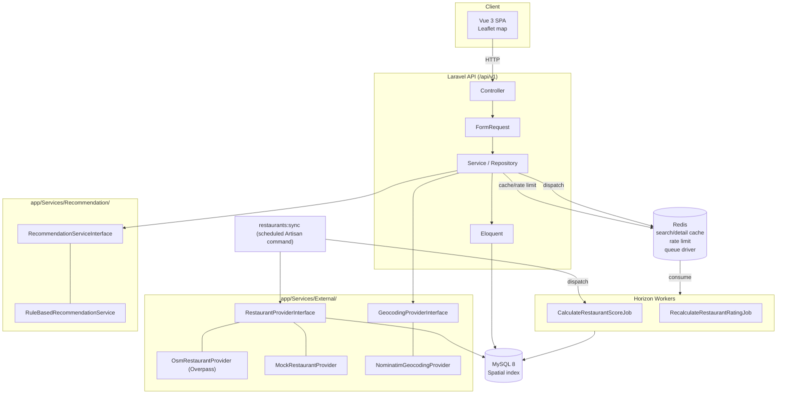

# VeggieMap

> A scalable vegetarian-friendly restaurant discovery platform built with Laravel, MySQL, Redis and modern geospatial search.

素食 × 地圖 × 多條件搜尋 × 寵物友善 × 使用者回報 × 素食可信度的餐廳探索平台。這是一個以「展示中高階
Backend Engineer 系統設計能力」為目標的作品專案，不是一個簡單 CRUD demo。

現況：後端 API（Phase 0–8.5）與前端 MVP（Phase 9：地圖／搜尋／收藏／評論／Admin 審核）已完成
並實測。詳細進度見 [docs/progress.md](docs/progress.md)，剩餘規劃見 [docs/todo.md](docs/todo.md)。

## Features

- **地理空間搜尋**：MySQL `POINT SRID 4326` + Spatial Index，兩段式查詢（Bounding Box 過濾 →
  `ST_Distance_Sphere` 精算距離），不把整張表撈出來在 PHP 算距離。
- **多條件篩選**：keyword／city／district／diet（vegan/vegetarian/…）／price_level／rating_min／
  pet_friendly／parking，搭配 cursor pagination。
- **地址搜尋（Geocoding）**：使用者輸入地名/地標（例如「台中一中街」）轉經緯度，串接
  `GET /restaurants` 半徑搜尋，Redis cache 擋掉重複查詢。
- **素食可信度系統**：`restaurant_verifications`（店家自主認領／菜單驗證／使用者確認／照片／
  外部資料源／管理員確認六種類型，各自帶可調整權重）加總成 0–100 的 confidence score。
- **使用者系統**：Sanctum Bearer Token 認證、收藏、評論（同一使用者對同一餐廳只留一筆
  active review，重新評論＝覆蓋並保留歷史）、店家問題回報。
- **Admin 審核**：回報／評論的 approve／reject／hide 端點，Policy 限定 admin 角色。
- **外部資料匯入**：`restaurants:sync` 從 OpenStreetMap Overpass API 匯入餐廳資料，Adapter Pattern
  可替換成其他資料源；同名＋距離 <100m 標記為 possible duplicate，不自動合併/刪除。

## Architecture



完整技術選型與「Why」寫在 [docs/architecture.md](docs/architecture.md)。

## Tech Stack

**Backend**：Laravel 11（PHP 8.2）、MySQL 8（Spatial functions）、Redis（cache + queue driver）、
Laravel Sanctum、Laravel Pint（formatter）。

**Frontend**：Vue 3 + TypeScript（`<script setup>`）、Vite（透過 `laravel-vite-plugin` 整合，SPA
由 Laravel blade shell 渲染、HMR 走 Vite dev server）、Pinia、Vue Router（history 模式）、Axios、
Leaflet + `leaflet.markercluster`。

**Infra**：Docker Compose（app / nginx / mysql / redis）。

## Database Design

13 張核心表：`restaurants`、`diet_types`／`restaurant_diet_types`、`features`／
`restaurant_features`、`menu_items`、`restaurant_verifications`、
`restaurant_confidence_scores`、`restaurant_reports`、`users`、`favorites`、`reviews`、
`external_api_logs`（不含 `personal_access_tokens`／`telescope_entries` 等框架基礎設施表）。
ERD 見 [docs/database.md](docs/database.md#erd)。

欄位設計、Index 選擇的理由（哪些 index 為什麼建、複合 index 怎麼排序）完整記錄在
[docs/database.md](docs/database.md)。

## API Documentation

所有端點前綴 `/api/v1`，統一回應格式：

```json
// 成功
{ "success": true, "data": {}, "meta": {} }

// 錯誤
{ "success": false, "error": { "code": "RESTAURANT_NOT_FOUND", "message": "Restaurant not found" } }
```

| Method | Path | 說明 | 認證 |
|---|---|---|---|
| GET | `/restaurants` | 列表＋多條件搜尋＋半徑搜尋 | 選用 |
| GET | `/restaurants/{id}` | 詳情（含 diet types／features／menu／confidence score） | 選用 |
| GET | `/restaurants/{id}/reviews` | 評論列表 | 選用 |
| POST | `/restaurants/{id}/favorite` | 加入收藏 | 必須 |
| DELETE | `/restaurants/{id}/favorite` | 取消收藏 | 必須 |
| POST | `/restaurants/{id}/reviews` | 新增評論（覆蓋舊的 active review） | 必須 |
| POST | `/restaurants/{id}/reports` | 回報店家問題 | 必須 |
| GET | `/diets` \| `/features` | 固定清單 | 無 |
| GET | `/geocode?q=` | 地址/地標轉經緯度 | 無 |
| POST | `/auth/register` \| `/auth/login` | 註冊／登入 | 無 |
| POST | `/auth/logout` | 登出（撤銷 token） | 必須 |
| GET | `/me` \| `/me/favorites` | 個人資料／收藏列表 | 必須 |
| GET/POST | `/admin/reports`、`/admin/reviews` | Admin 審核回報／評論 | 必須（admin） |

範例：

```
GET /api/v1/restaurants?latitude=24.1477&longitude=120.6736&radius=5&diet=vegan&pet_friendly=1
GET /api/v1/geocode?q=台中一中街
```

完整查詢參數、分頁規則、錯誤碼列在 [docs/api.md](docs/api.md)。機器可讀的 OpenAPI 3.0 規格見
[`docs/openapi.yaml`](docs/openapi.yaml)（可直接丟進 Swagger UI／Postman 匯入），
`npx @redocly/cli lint docs/openapi.yaml` 驗證過 0 error。

## Local Development

```bash
git clone https://github.com/thothawei/veggie-map.git
cd veggie-map
cp .env.example .env
docker compose up -d --build
docker compose exec app composer install
docker compose exec app php artisan key:generate
docker compose exec app php artisan migrate --seed
```

前端跑在 host 上（不在 Docker 裡），需要另外裝 Node 依賴並啟動 Vite：

```bash
npm install
npm run dev
```

打開 `http://localhost:8080/` 就是完整的 SPA（Laravel blade shell 用 `@vite` 載入 Vite dev
server 的模組做 HMR，不是把整個 SPA 另外架在 5173——`npm run dev` 只負責前端資產編譯）。
API 本身在 `http://localhost:8080/api/v1`（host port 依 `docker-compose.yml` 設定，見下方
Docker 章節）。Production build：`npm run build`（含 `vue-tsc` 型別檢查，不過就直接失敗）。

## Docker

`docker-compose.yml` 定義六個服務：`app`（PHP 8.2-fpm）、`horizon`（跟 `app` 同一個
image，改跑 `php artisan horizon` 消化 Redis 佇列）、`scheduler`（`php artisan schedule:work`，
跑每日同步與評分重算）、`nginx`、`mysql`、`redis`。本機若
3306/80 已被其他專案佔用，host 對外映射改成 `3307`/`8080`（容器內部 port 不變）。

```bash
docker compose up -d      # 啟動
docker compose ps         # 確認六個服務都是 Running
docker compose logs -f app
docker compose logs -f horizon   # 確認 queue worker 真的在跑、有沒有 failed job
```

## Testing

```bash
./scripts/setup-test-db.sh   # 第一次跑測試前執行一次即可（可重複執行，冪等）
docker compose exec app php artisan test
```

206 個 Feature/Unit test、608 個 assertion（2026-08-25 實測），涵蓋所有已實作端點（含 Sanctum 401/token 撤銷、
Policy 授權、review 覆蓋邏輯、confidence score 計算、`restaurants:sync` 冪等性與去重、
`RestaurantRepository` bounding box 純數學、`ReviewService` 真實併發競態、
`RuleBasedRecommendationService` 加權排序、search/detail cache 命中與失效、rate limiting
429、`users:promote`、批次計算 Job 排程——不是只驗證回應內容，快取那組測試直接斷言重複
請求的 DB query 數為 0；測試環境 `QUEUE_CONNECTION=sync`，Job 仍然同步跑完才斷言結果，
不需要真的等 Horizon worker）。

測試用 MySQL（非 sqlite in-memory）——schema 用了 `POINT`／`ST_Distance_Sphere`／`MBRContains`
等 MySQL 專屬空間函式，sqlite 跑不起來，所以需要 `scripts/setup-test-db.sh` 先建立
`veggiemap_testing` 資料庫並跑 migration。全新的 Docker volume 也會透過
`docker/mysql/init/01-create-test-database.sql` 自動建立（MySQL 官方 image 只在 volume
第一次初始化時執行 `docker-entrypoint-initdb.d`），但既有的舊 volume 不會自動重跑，這是
`scripts/setup-test-db.sh` 存在的原因——CI 或任何時候都能安全重跑。

前端：

```bash
npm run type-check   # vue-tsc --noEmit
npm run test         # Vitest，目前只涵蓋純邏輯（例如 lib/geo.ts 的距離計算）
```

沒有 Vitest 元件測試或 Playwright E2E——golden path（地圖／搜尋／收藏／評論／Admin 審核）
目前靠手動瀏覽器驗證覆蓋，見 [docs/progress.md](docs/progress.md) Phase 9/10 與
[docs/todo.md](docs/todo.md)。

## External APIs

| API | 用途 | 備註 |
|---|---|---|
| OpenStreetMap Overpass API | `restaurants:sync` 批次匯入餐廳資料 | 免費、無 API key，僅離線批次使用，30s timeout + 429 退避重試 |
| Nominatim | 使用者主動地址搜尋（`/geocode`） | 免費、每秒最多 1 次請求，5s timeout + 429 退避重試，同查詢字串 Redis cache 1 天 |
| Mock Provider | 開發/測試環境保底 | Overpass 斷線或本機無網路時仍可 demo，5 筆內建 fixture |

完整的評估過程（是否免費、rate limit、license、是否允許 Portfolio 使用）見
[docs/external-apis.md](docs/external-apis.md)。**踩過的坑**：Nominatim 對帶有
`example.com` 這類常見教學範例網域的 `User-Agent` 字串直接回 403，不是程式碼邏輯問題。

## Caching Strategy

- 搜尋結果：`restaurants:search:{md5(filters)}`，TTL 300s（避免重複的 Spatial Query 打 DB）。
- 餐廳詳情：`restaurant:{id}`，TTL 600s。
- 地址搜尋：`geocode:{md5(query)}`，TTL 1 天（配合 Nominatim rate limit，而非效能考量）。
- 寫入後清快取：`Restaurant`／`RestaurantConfidenceScore` 掛 Observer，存檔即清對應的
  `restaurant:{id}` 與 `Cache::tags(['restaurants'])`。**不使用** `Cache::flush()`——
  只清相關 key，不影響 geocode 之類無關的 cache。
- 驗證方式：`tests/Feature/Api/RestaurantCachingTest.php` 直接斷言重複請求的 DB query
  數為 0，不是只看回應內容對不對（回應對，快取可能根本沒接上也看不出來）。

## Queue Architecture

`CalculateRestaurantScoreJob`、`RecalculateRestaurantRatingJob` 都實作 `ShouldQueue`，並透過
[Laravel Horizon](https://laravel.com/docs/horizon) 真正非同步處理——`docker-compose.yml` 有
獨立的 `horizon` container 跑 `php artisan horizon`，`QUEUE_CONNECTION=redis` 底層佇列真的
有 worker 在消化，呼叫端一律用 `dispatch()`。`/horizon` 儀表板走跟 Telescope 一樣的 gate 模式
（`app/Providers/HorizonServiceProvider::gate()`，白名單預設空陣列，production 環境沒有列進
白名單的使用者一律看不到）。

`routes/console.php` 已排程 `restaurants:recalculate-ratings`／`restaurants:calculate-scores`
每天跑一次。`restaurants:sync` 因為這個專案沒有正式決定過要自動涵蓋哪些城市範圍，改用
`EXTERNAL_API_SYNC_BBOXES` 環境變數控制（格式 `"minLat,minLng,maxLat,maxLng"`，多組用分號
分隔）——預設留空，不會自動排程，避免自己編一組座標假裝是產品決策。

## Geospatial Search

`restaurants.location` 是 `POINT SRID 4326` + Spatial Index。查詢分兩段：先用經緯度算出
Bounding Box，`MBRContains` 過濾出候選集合（能用到 Spatial Index），再對候選集合算
`ST_Distance_Sphere` 精確距離排序。避免對整張表做未過濾的距離計算。細節與 SQL 範例見
[docs/database.md](docs/database.md)。

## Security

- 密碼 hashing：Laravel 原生（不自行實作）。
- 認證：Laravel Sanctum Bearer Token（API-only，未使用 SPA cookie 模式）。
- 授權：Policy（`ReviewPolicy`／`RestaurantReportPolicy`），Admin 動作額外檢查 `role`。
- Rate Limiting：整個 `/api/v1/*` 60 次／分鐘，Redis-based（`AppServiceProvider` 的
  `RateLimiter::for('api', ...)`），依登入使用者 id 或 IP 分桶，超過回 429。
- Mass assignment：所有 Model 明確宣告 `$fillable`。
- API 錯誤格式統一經 `ApiExceptionRenderer`，不外洩 Laravel 預設例外堆疊訊息（production）。
- `.env`／API Key 不進版控（`.gitignore` 已排除）。
- 已知待處理：`composer audit` 的 `CVE-2026-48019`（email 驗證規則 CRLF injection），MVP 範圍
  接受，正式升版前需處理，見 [docs/progress.md](docs/progress.md)。

## Performance

- 列表 API 用 `select()`／`with()` 避免 N+1，cursor pagination 取代 offset pagination。
- `per_page` 上限 100，避免使用者要求超大分頁拖垮資料庫。
- Rating／confidence score 是快取欄位（`restaurants.rating`／`rating_count`、
  `restaurant_confidence_scores.score`），不即時計算，由 Job 批次更新。

## Observability

外部 API 呼叫（Overpass／Nominatim）記錄進 `external_api_logs`（provider／status／
response_time_ms／success／error_code，不記 API Key）；`/api/*` 例外統一格式化並記進
`storage/logs/laravel.log`。API response time／cache hit-miss／DB 慢查詢追蹤目前**未實作**——
完整的「有 vs 沒有」對照表見 [docs/observability.md](docs/observability.md)，誠實記錄而非
畫大餅。

本機開發另外裝了 [Laravel Telescope](https://laravel.com/docs/telescope)（`http://localhost:8080/telescope`），
可視覺化檢視 request／SQL query／job／cache hit-miss／exception，只在 `local`／`testing`
環境註冊（見 `AppServiceProvider::register()`），production 不會載入這個 provider，
`/telescope` 路由也不會存在——不是只靠 `TelescopeServiceProvider::gate()` 這一層防護。

## CI/CD

[`.github/workflows/ci.yml`](.github/workflows/ci.yml)，push/PR 到 `main` 時觸發，兩個平行 job：

- **Backend**：`composer install` → 建前端資產（`/` 是 SPA shell，render 需要 Vite
  manifest）→ `pint --test` → `phpstan analyse`（Larastan, level 5）→ MySQL service
  container → migrate → `php artisan test`。
- **Frontend**：`npm ci` → `eslint` → `vue-tsc --noEmit` → `vitest run` → `npm run build`。

第一次真的跑在 GitHub Actions 上時抓到 3 個本機環境掩蓋掉的真 bug（mock fixture 從沒進
版控、`/` 依賴的 Vite manifest 在全新 checkout 不存在、Vitest 誤吃到 `laravel-vite-plugin`
的 CI 防呆機制），細節見 [docs/progress.md](docs/progress.md) Phase 12。

## AI Office（多 Agent 開發平台子系統）

同一個 repo 內另有一個進行中的子系統 **AI Office**：使用者對 AI CEO 提需求，由 CEO 拆解
任務、建立相依圖、指派給不同角色的 Agent，透過 Redis Queue 執行、呼叫工具、QA 驗證、
高風險操作走人工核准。定位是 Multi-Agent AI Software Development Platform，不是聊天機器人。

- 完整規劃、與本 repo 既有技術棧的衝突裁決、12 個 Phase 的路線圖：
  [docs/implementation-plan.md](docs/implementation-plan.md)
- 隔離方式：命名空間 `App\AiOffice\*`、資料表前綴 `ai_office_`、路由前綴
  `/api/v1/ai-office/*`、前端 `resources/js/ai-office/*`，不與餐廳領域混在一起。
- 刻意偏離原始規格之處（規格假設是全新專案）：沿用 MySQL 而非 PostgreSQL（餐廳查詢
  建立在 MySQL 空間函式上）、沿用 Vue 3 + Pinia 而非 React + Zustand、沿用 PHPUnit
  而非 Pest。理由逐條寫在 implementation-plan 的「Conflicts with the Spec」。
- 設定集中在 [config/ai_office.php](config/ai_office.php)：workspace 邊界、LLM provider
  （預設 `mock`，不會不小心打真的 API）、Agent loop 硬上限、沙箱參數。
- Readiness 端點：`GET /api/v1/ai-office/health`（需登入且具備 AI Office 角色）。
  資料庫／Redis／佇列／workspace 都是**真的去連**，任一項不通就回 503 `degraded`。

目前進度：**Phase 1 完成**（基礎設施驗證、設定骨架、RBAC 四角色、readiness 端點）。

## Future Roadmap

- Laravel Horizon + 真正的 queue worker（目前 `dispatchSync` 頂著）
- 前端元件測試／Playwright E2E（目前 Vitest 只測 `lib/geo.ts` 這種純邏輯，golden path
  靠手動瀏覽器驗證）
- 實際 AWS 部署（部署文件已完成，見 [docs/deployment.md](docs/deployment.md)；
  需使用者確認 credentials 後才執行）
- 更長期：AI 推薦、Menu OCR、使用者聲譽系統（見總體規劃文件，第一版 MVP 刻意不做）

---

完整開發歷程（含踩過的坑與為什麼這樣設計）逐 Phase 記錄在 [docs/progress.md](docs/progress.md)。
