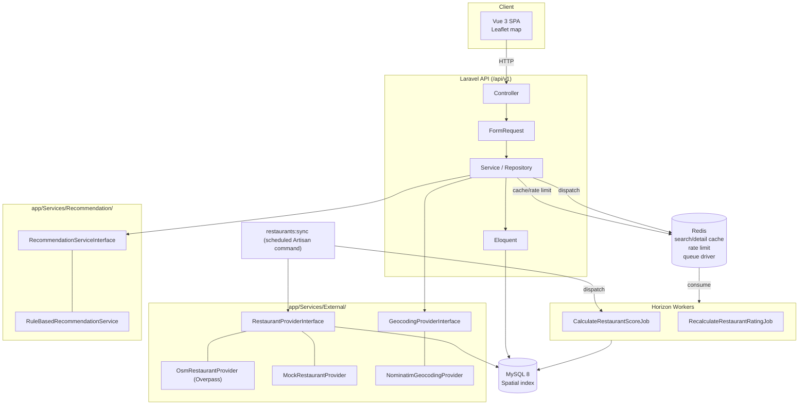

# Architecture — VeggieMap

## 專案定位

素食 × 地圖 × 多條件搜尋 × 寵物友善 × 使用者回報 × 素食可信度的餐廳探索平台。技術目標是展示中高階
Backend Engineer 的系統設計能力（RESTful API、快取策略、佇列架構、地理空間搜尋、可替換的外部資料源
Adapter），而不是做一個簡單 CRUD。

## 系統圖

對照現況重畫過（原本的文字方塊圖從 Phase 0 之後沒更新，裡面的 `SyncRestaurantDataJob`／
`ProcessUserReportJob` 其實從來沒有實作過——`restaurants:sync` 是同步執行的 Artisan
指令，不是排進佇列的 Job；使用者回報是在 `RestaurantReportController` 裡同步處理，沒有
對應的 Job。這份圖只畫真的存在的東西）。用 `@mermaid-js/mermaid-cli` 渲染驗證過。



## 技術選型與 Why

| 技術 | 用在哪 | 為什麼 |
|---|---|---|
| Laravel | API 主體 | FormRequest／Policy／Queue／Horizon 是這個專案要展示的能力清單裡的原生支援，不必自己重造 |
| MySQL + Spatial (`POINT` SRID 4326) | Restaurant 座標與半徑搜尋 | 題目本身要求不能把全部資料撈出來在 PHP 算距離；MySQL 8 原生支援 `ST_Distance_Sphere` 與 Spatial Index，資料庫層面做地理過濾比應用層快一個數量級，且不需要額外引入 PostGIS/Elasticsearch 這種對履歷專案而言過重的依賴 |
| Redis：Cache | 搜尋結果、餐廳詳情 | 搜尋條件組合多（keyword/diet/price/pet_friendly/…），同組條件短時間內重複查詢很常見；Cache 把重複的 Spatial Query 擋在 DB 前面 |
| Redis：Rate Limit | `/api/v1/restaurants` | 這條 API 允許匿名存取，是最容易被打的端點；Redis-based limiter 比 DB-based 快且不佔用主要資料庫連線 |
| Redis：Queue driver + Horizon | 外部資料同步、分數計算、評分重算、回報處理 | 這些工作都不該卡在 HTTP request 裡：`restaurants:sync` 可能跑數分鐘、分數計算牽涉多筆 join。Horizon 提供 Queue 的可視化監控，是履歷上「我知道怎麼維運非同步系統」的直接證據 |
| Adapter Pattern（`RestaurantProviderInterface`） | 外部資料源 | 免費 API 沒有 SLA 保證（見 `external-apis.md`），今天用 Overpass，明天可能要換成付費地圈服務或別的資料源；Controller/Service 只依賴介面，替換 Provider 不動呼叫端一行程式碼 |
| Repository/Service 分層 | 所有寫入/查詢邏輯 | Controller 不放商業邏輯（規則第 9 條）；Service 負責邏輯，Repository 負責查詢組裝，方便個別做 Unit Test |
| Cursor Pagination（列表 API） | `/api/v1/restaurants` | Offset pagination 在資料量成長後 `OFFSET N` 會全表掃描前 N 筆，效能隨頁數線性下降；Cursor（依 `id` 或複合鍵）維持 O(log n) 索引查找，題目第 32 節明確要求避免 offset pagination 在大型資料集的問題 |
| Sanctum | 使用者驗證 | SPA + API 同源／跨網域皆可用的輕量 Token 方案，不需要完整 OAuth Server（那對這個規模是過度設計） |
| Policy（非 Gate） | Review/Report/Favorite 授權 | 授權規則跟著 Model 走（「使用者只能改自己的 Review」），用 Policy 是 Laravel 慣例，比手寫 if 分散在 Controller 更容易稽核 |

## 素食可信度分數（Confidence Score）架構

- `restaurant_verifications`：逐筆記錄「誰在什麼時候用什麼方式驗證了這家店」，是事實紀錄，不可覆寫、不摘要。
- `restaurant_confidence_scores`：`restaurants.id` 對應的**目前分數快照**，由
  `CalculateRestaurantScoreJob` 依據 `restaurant_verifications` 重新計算後寫入，查詢端只讀這張表，
  不必每次即時彙總——這跟 rating/rating_count 的設計邏輯一致（見下方）。
- 權重放在 `config/vegetarian.php`，Service 讀 config 而非寫死數字，未來要調整權重（例如「近期使用者確認」
  該不該衰減）不需要改程式碳。

## Rating 更新策略

`reviews` 表是逐筆評論，`restaurants.rating`／`restaurants.rating_count` 是快取欄位。避免「每次查詢都
重新 AVG()」，改由 `RecalculateRestaurantRatingJob` 在 Review 新增/修改/刪除後（Observer 觸發）非同步
更新快取欄位。讀取路徑因此是 O(1) 欄位讀取，不是每次 join+group by。

## Cache Invalidation 策略

- Key 設計：`restaurant:{id}`（detail）、`restaurants:search:{hash}`（hash 為排序後查詢參數的雜湊）。
- Restaurant 異動（含分數重算、評分重算）時，只刪 `restaurant:{id}` 與該筆資料可能命中的 search cache——
  search cache 用「加前綴＋短 TTL（300s）」取代精準失效，因為列舉「哪些 search hash 涵蓋這家店」成本
  高於直接讓它 5 分鐘後自然過期。Production 環境嚴禁 `Cache::flush()`（規則第十七節），只在
  `local`/`testing` 環境的測試輔助函式中允許。

## 資料同步管線

```
Overpass API → Normalize（座標/名稱正規化）→ Validate（必要欄位、座標範圍）
→ Deduplicate（同名 + 距離 < 100m → 標記 possible_duplicate，不自動刪除）
→ Upsert（依 source+source_id）→ Dispatch CalculateRestaurantScoreJob
```

用 `chunk()`／cursor 讀取匯入結果，避免一次性把整批資料塞進記憶體（規則第 21 節）。

## AI 預留（`RuleBasedRecommendationService` 已實作，AI 版本不在 MVP 範圍）

`RecommendationServiceInterface`（`app/Services/Recommendation/`）第一版只有
`RuleBasedRecommendationService` 實作，權重放 `config/recommendation.php`，
`GET /restaurants/recommended` 供前端首頁「推薦餐廳」使用（見 [docs/api.md](api.md)）。
未來加 `AIRecommendationService` 時，呼叫端（`RestaurantController`）不需要改，只改
`AppServiceProvider` 的介面綁定——這是 Adapter Pattern 在推薦系統上的延伸應用，不是
另外發明一套機制。

## 明確不做的事（MVP 邊界）

比照規則第四十三節：本階段不做 AI、Payment、Subscription、複雜 Admin、Notification、Recommendation ML。
任何 Phase 若發現會不小心把這些做進去，回報後暫停，不要順手做掉。
