# Database Design — VeggieMap

Phase 0 產出，正式 migration 在 Phase 2 實作。這份文件是設計依據，欄位名稱與型別可能在 Phase 2
微調（微調時要回來更新這份文件，不能讓文件與 migration 分岔）。

## ERD

直接對照 `database/migrations/` 實際欄位與外鍵畫的（不是憑當初設計草稿），13 張核心表，
不含 Laravel 框架自帶的 `personal_access_tokens`／`cache`／`jobs`／`sessions`／
`telescope_entries` 等基礎設施表。

```mermaid
erDiagram
    RESTAURANTS ||--o{ RESTAURANT_DIET_TYPES : has
    DIET_TYPES ||--o{ RESTAURANT_DIET_TYPES : has
    RESTAURANTS ||--o{ RESTAURANT_FEATURES : has
    FEATURES ||--o{ RESTAURANT_FEATURES : has
    RESTAURANTS ||--o{ MENU_ITEMS : has
    RESTAURANTS ||--o{ RESTAURANT_VERIFICATIONS : has
    USERS ||--o{ RESTAURANT_VERIFICATIONS : verifies
    RESTAURANTS ||--|| RESTAURANT_CONFIDENCE_SCORES : has
    RESTAURANTS ||--o{ RESTAURANT_REPORTS : "reported in"
    USERS ||--o{ RESTAURANT_REPORTS : files
    RESTAURANTS ||--o{ FAVORITES : "favorited in"
    USERS ||--o{ FAVORITES : has
    RESTAURANTS ||--o{ REVIEWS : has
    USERS ||--o{ REVIEWS : writes

    RESTAURANTS {
        bigint id PK
        string name
        string slug UK
        text description
        string address
        string city
        string district
        decimal latitude
        decimal longitude
        point location "SRID 4326 - spatial index"
        string phone
        string website
        tinyint price_level
        decimal rating "cache - RecalculateRestaurantRatingJob 更新"
        int rating_count
        enum source "manual/osm/external_api/user"
        string source_id
        enum status "active/inactive/pending"
        boolean is_possible_duplicate
    }
    DIET_TYPES {
        bigint id PK
        string code UK
        string label
    }
    RESTAURANT_DIET_TYPES {
        bigint restaurant_id FK
        bigint diet_type_id FK
    }
    FEATURES {
        bigint id PK
        string code UK
        string label
    }
    RESTAURANT_FEATURES {
        bigint restaurant_id FK
        bigint feature_id FK
    }
    MENU_ITEMS {
        bigint id PK
        bigint restaurant_id FK
        string name
        text description
        decimal price
        enum diet_type "vegan/vegetarian/non_vegetarian/unknown"
        boolean is_available
    }
    RESTAURANT_VERIFICATIONS {
        bigint id PK
        bigint restaurant_id FK
        enum verification_type
        tinyint score "config/vegetarian.php 權重"
        bigint verified_by FK "nullable - users.id"
        timestamp verified_at
        timestamp expires_at "nullable"
        json metadata
    }
    RESTAURANT_CONFIDENCE_SCORES {
        bigint restaurant_id PK "also FK to restaurants.id"
        tinyint score "0-100 - CalculateRestaurantScoreJob 更新"
        timestamp calculated_at
    }
    RESTAURANT_REPORTS {
        bigint id PK
        bigint user_id FK
        bigint restaurant_id FK
        enum type "closed/not_vegetarian/wrong_info/..."
        text description
        enum status "pending/approved/rejected"
        bigint reviewed_by FK "nullable - users.id"
        timestamp reviewed_at
    }
    USERS {
        bigint id PK
        string name
        string email UK
        string password
        enum role "user/admin"
    }
    FAVORITES {
        bigint user_id FK
        bigint restaurant_id FK
    }
    REVIEWS {
        bigint id PK
        bigint user_id FK
        bigint restaurant_id FK
        tinyint rating "1-5"
        text comment
        enum status "active/hidden -覆蓋舊評論用"
    }
    EXTERNAL_API_LOGS {
        bigint id PK
        string provider
        string endpoint
        smallint status
        int response_time_ms
        boolean success
        string error_code
    }
```

`external_api_logs` 沒有外鍵關聯到任何表——它是 `OsmRestaurantProvider`／
`NominatimGeocodingProvider` 的獨立稽核記錄，見 [docs/observability.md](observability.md)。
`restaurant_confidence_scores.restaurant_id` 同時是 PK 也是 FK（1:1 關係，見下方
`restaurant_confidence_scores` 章節）。

## 核心表

### restaurants

| 欄位 | 型別 | 說明 |
|---|---|---|
| id | bigint unsigned, PK | |
| name | varchar(255) | |
| slug | varchar(255), unique | URL 用，供 `/restaurants/{slug}` |
| description | text, nullable | |
| address | varchar(255) | |
| city | varchar(100) | |
| district | varchar(100) | |
| latitude | decimal(10,7) | 人類可讀／debug 用，實際查詢走 `location` |
| longitude | decimal(10,7) | 同上 |
| location | `POINT SRID 4326` | 空間查詢欄位，由 latitude/longitude 產生，寫入時同步更新 |
| phone | varchar(50), nullable | |
| website | varchar(255), nullable | |
| price_level | tinyint unsigned, nullable | 1~4 |
| rating | decimal(3,2), default 0 | 快取欄位，由 `RecalculateRestaurantRatingJob` 更新，不即時計算 |
| rating_count | int unsigned, default 0 | 同上 |
| source | enum(manual,osm,external_api,user) | |
| source_id | varchar(255), nullable | 對應來源系統的 ID，供去重與重新匯入比對 |
| status | enum(active,inactive,pending) | |
| is_possible_duplicate | boolean, default false | Deduplication 標記，供 Admin 審核，不自動刪除 |
| created_at / updated_at | timestamp | |

**Index：**

| Index | 欄位 | 用途 |
|---|---|---|
| `restaurants_slug_unique` | `slug` | 詳情頁查詢，`GET /restaurants/{slug}` |
| `restaurants_city_district_idx` | `(city, district)` | 依行政區過濾，複合索引支援「只給 city」與「city+district」兩種查法 |
| `restaurants_status_idx` | `status` | 幾乎每個查詢都會加 `WHERE status = 'active'`，需要獨立索引而非只靠複合索引覆蓋 |
| `restaurants_rating_idx` | `rating` | 支援 `sort=rating` |
| `restaurants_price_level_idx` | `price_level` | 支援價格區間過濾 |
| `restaurants_source_source_id_unique` | `(source, source_id)` | Upsert 去重的依據，必須唯一 |
| `restaurants_location_spatial` | `location` (SPATIAL INDEX) | 半徑搜尋核心索引；MySQL Spatial Index 需要 `NOT NULL` 欄位，因此 `location` 不可為 null |

半徑搜尋策略：先用經緯度算出的 Bounding Box 做 `MBRContains`/範圍過濾（能吃到 Spatial Index），
再對縮小後的候選集用 `ST_Distance_Sphere` 算精確距離並排序——避免對全表直接跑
`ST_Distance_Sphere`（那樣即使有 Spatial Index 也無法被使用，等同全表掃描）。

**座標軸順序陷阱（Phase 2 實測過）**：MySQL 8 對 SRID 4326 強制套用 EPSG:4326 定義的軸順序
（緯度在前、經度在後），跟一般「經度, 緯度」的直覺相反。正確寫法是先用笛卡兒座標建立
`POINT(lng, lat)`，再用 `ST_SRID(..., 4326)` 綁定，讓 MySQL 依 4326 規則重新解讀——
寫入與查詢兩邊都要用同一種順序，細節見 `app/Models/Restaurant.php` 的註解跟
`database/factories/RestaurantFactory.php` 的實作。如果改成直接
`ST_GeomFromText("POINT($lng $lat)", 4326)`，順序在小範圍座標下不會報錯，只會安靜地把
地圖左右鏡射，很難發現——Phase 3 寫 Repository 時不要重新發明這段。

### diet_types / restaurant_diet_types（Many-to-Many）

`diet_types`：`id`, `code`（vegan/vegetarian/ovo_lacto/lacto/ovo/vegan_friendly/vegetarian_friendly）,
`label`, `created_at/updated_at`。不 hard-code 在 Controller，程式碼一律用 `code` 查。

`restaurant_diet_types`：`restaurant_id`, `diet_type_id`, `created_at`。
Composite unique：`(restaurant_id, diet_type_id)`；Index：`diet_type_id`（供「這個飲食類型有哪些餐廳」反查，是 `?diet=vegan` 過濾的查詢路徑）。

### features / restaurant_features（Many-to-Many）

`features`：`id`, `code`（pet_friendly/parking/delivery/takeout/reservation/wifi/outdoor_seating/family_friendly）, `label`。

`restaurant_features`：`restaurant_id`, `feature_id`。Composite unique：`(restaurant_id, feature_id)`；
Index：`feature_id`。

### menu_items

| 欄位 | 型別 |
|---|---|
| id | bigint unsigned, PK |
| restaurant_id | bigint unsigned, FK → restaurants |
| name | varchar(255) |
| description | text, nullable |
| price | decimal(8,2), nullable |
| diet_type | enum(vegan,vegetarian,non_vegetarian,unknown) |
| is_available | boolean, default true |

Index：`restaurant_id`（詳情頁列出菜單的主要查詢路徑）。

### restaurant_verifications

| 欄位 | 型別 |
|---|---|
| id | bigint unsigned, PK |
| restaurant_id | bigint unsigned, FK |
| verification_type | enum(restaurant_claim,menu_verified,user_report,photo_verified,external_source,admin_verified) |
| score | tinyint unsigned | 該筆驗證貢獻的分數，對應 `config/vegetarian.php` 的權重 |
| verified_by | bigint unsigned, nullable, FK → users | |
| verified_at | timestamp | |
| expires_at | timestamp, nullable | 供「近期使用者確認」這種會過期的驗證類型使用 |
| metadata | json, nullable | |

Index：`(restaurant_id, verification_type)`（分數計算時依餐廳＋類型彙總）。

### restaurant_confidence_scores

`restaurant_id`（PK，一對一）, `score`（0~100）, `calculated_at`。由
`CalculateRestaurantScoreJob` 整批重算後 upsert，查詢端只讀這張表不即時彙總 `restaurant_verifications`。

### restaurant_reports

| 欄位 | 型別 |
|---|---|
| id | bigint unsigned, PK |
| user_id | bigint unsigned, FK |
| restaurant_id | bigint unsigned, FK |
| type | enum(closed,not_vegetarian,wrong_info,menu_changed,wrong_address,wrong_hours,other) |
| description | text, nullable |
| status | enum(pending,approved,rejected) |
| reviewed_by | bigint unsigned, nullable, FK → users |
| reviewed_at | timestamp, nullable |

Index：`(restaurant_id, status)`（Admin 審核佇列查詢）、`user_id`（使用者查自己回報過什麼）。

### users

`id`, `name`, `email`(unique), `password`, `role` enum(user,admin)。Sanctum 標準欄位另計。

### favorites

`user_id`, `restaurant_id`, `created_at`。Composite unique：`(user_id, restaurant_id)`（題目明確要求）。
Index：`restaurant_id`（供「這家店被幾人收藏」之類的未來統計）。

### reviews

| 欄位 | 型別 |
|---|---|
| id | bigint unsigned, PK |
| user_id | bigint unsigned, FK |
| restaurant_id | bigint unsigned, FK |
| rating | tinyint unsigned（1~5） |
| comment | text, nullable |
| status | enum(active,hidden) — 對應「同一使用者對同一餐廳只能有一筆 active review」 |

Composite unique：`(user_id, restaurant_id, status)` 需搭配應用層邏輯（DB unique 無法單獨表達「只限
status=active 才唯一」，改用 Service 層先查再寫入＋交易鎖，或用 partial unique index 的替代方案是
MySQL 不支援條件式 unique index，因此以 Service 層交易保證）。Index：`restaurant_id`（詳情頁列評論、
`RecalculateRestaurantRatingJob` 的彙總查詢）。

### external_api_logs

| 欄位 | 型別 |
|---|---|
| id | bigint unsigned, PK |
| provider | varchar(50) |
| endpoint | varchar(255) |
| status | smallint |
| response_time_ms | int unsigned |
| success | boolean |
| error_code | varchar(100), nullable |
| created_at | timestamp |

**絕對不記錄** API Key／Token／Password（規則第 34 節）。Index：`(provider, created_at)`（依 provider
查最近失敗率，觀測用）。

## Deduplication 判斷

匯入時「同名 + 距離 < 100m」視為可能重複，寫入時把新舊兩筆都標記 `is_possible_duplicate = true`，
不自動合併/刪除，交給 Admin 審核（Phase 8 實作於 `restaurants:sync`）。
